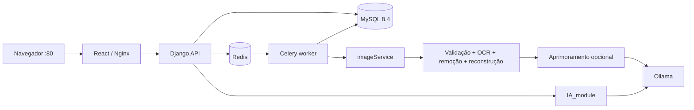

# Anato360 com Docker

A interface em `frontend/` usa os componentes, fontes, cores e layouts do projeto
Figma enviado em `Website with User Features.zip`. Login, uploads, rótulos, quiz,
progresso e chat usam a API. `frontend_anato360/` é uma referência anterior.

## Iniciar

1. Instale Docker com Compose v2; no Windows, inicie Docker Desktop em modo Linux.
2. Copie `.env.example` para `.env` **somente se ainda não tiver um `.env`**.
3. Configure `DJANGO_SECRET_KEY`, `MYSQL_PASSWORD`, `MYSQL_ROOT_PASSWORD` e
   `DJANGO_SUPERUSER_PASSWORD`. Preserve as credenciais de um banco já inicializado.

Uma chave pode ser gerada com:

```bash
python -c "import secrets; print(secrets.token_hex(32))"
docker compose config --quiet
docker compose up -d --build
docker compose ps
docker compose logs -f ollama-models
```

A API executa as migrações e cria o administrador inicial automaticamente.
Entre com `DJANGO_SUPERUSER_EMAIL` ou `DJANGO_SUPERUSER_USERNAME` e sua senha.
Uma conta existente mantém sua senha. Usuários comuns podem se cadastrar na tela;
somente contas com `is_staff` no banco recebem permissões administrativas.

O frontend é publicado na **porta 80**:

- <http://localhost>
- <http://127.0.0.1>
- <http://200.18.75.25>
- <http://srv-01.tail881f91.ts.net>

Esses endereços precisam apontar para a máquina que executa Docker. O domínio
Tailscale depende de conexão à tailnet e resolução DNS. O Compose não configura
IP público, DNS ou firewall; libere TCP 80 no servidor. Os quatro hosts estão
em `.env.example`; atualize `DJANGO_ALLOWED_HOSTS` se mantiver um ambiente antigo.
Se mudar `APP_PORT`, inclua também a porta nas origens CSRF adicionais.

## Arquitetura



| Serviço | Responsabilidade |
| --- | --- |
| `frontend` | Build React e proxy Nginx; acesso público na porta 80 |
| `api` | Django/Gunicorn; autenticação, permissões, persistência e chat |
| `db` | MySQL 8.4 com utf8mb4, modo estrito e volume persistente |
| `redis` | Fila de tarefas Celery |
| `worker` | Processamento assíncrono, persistência de imagens e rótulos |
| `image-processor` | API interna do imageService, sem acesso direto ao banco |
| `ollama` | Um servidor compartilhado pelo chatbot e processamento visual |
| `ollama-models` | Baixa os modelos configurados e encerra com código zero |

A API adicional está publicada em `127.0.0.1:8000` para desenvolvimento.
MySQL, Redis, imageService e Ollama ficam na rede interna do Compose.
O navegador usa caminhos relativos `/api/`, sem hostname fixo ou CORS aberto.
O Nginx reconsulta o DNS interno para acompanhar recriações do container da API
([resolver](https://nginx.org/en/docs/http/ngx_http_core_module.html#resolver)).

## Imagens e IA

Usuários e administradores enviam imagens pela interface. Cada registro guarda
ID, dono, título, categoria, arquivos original/processado, visibilidade, status,
metadados e rótulos com coordenadas. Imagens privadas ficam disponíveis somente ao
dono e aos administradores; compartilhadas ficam disponíveis aos demais usuários
autenticados. Somente dono/admin pode editar ou remover.

O pipeline preserva a lógica do imageService: validação anatômica, OCR, máscara,
remoção e reconstrução local. Depois, quando solicitado no upload, o modelo visual
do Ollama sugere parâmetros conservadores e OpenCV aplica os filtros.
**O modelo de visão não gera uma imagem nova diretamente.** Se o aprimoramento
falhar, o resultado local é preservado e o aviso fica nos metadados.

Os rótulos OCR indicam o centro do texto removido, não necessariamente o ponto
anatômico indicado por uma linha. A interface permite corrigir texto, tradução
e marcadores e confirmá-los antes de utilizá-los no quiz. Pontuação é calculada
pela API; progresso e histórico do chat são persistidos por usuário.

| Variável | Padrão | Uso |
| --- | --- | --- |
| `OLLAMA_CHAT_MODEL` | valor de `OLLAMA_LLM_MODEL` (`llama3.1`) | Chat via IA_module; o preparador baixa o mesmo modelo |
| `OLLAMA_EMBEDDING_MODEL` | `nomic-embed-text` | Indexação de PDF |
| `OLLAMA_VISION_MODEL` | `llama3.2-vision:11b` | Análise visual dos filtros |
| `OLLAMA_REQUEST_TIMEOUT` | `300` | Timeout por chamada Ollama, em segundos |
| `IMAGE_USE_OLLAMA` | `false` | Habilita o download visual automático; a etapa também é selecionada por upload |
| `IMAGE_VALIDATE_ANATOMY` | `true` | Validação anatômica com CLIP |
| `IMAGE_OCR_GPU` | `false` | OCR em CPU por padrão |
| `WORKER_CONCURRENCY` | `1` | Tarefas simultâneas |

O primeiro início exige internet para imagens Docker e modelos, que ocupam vários
GB. Execução em CPU pode ser lenta e depende da RAM. `ollama-models` pode continuar
baixando depois que o frontend estiver saudável. O chat retorna um erro legível
enquanto seu modelo estiver indisponível; não usa respostas simuladas.
OCR/CLIP são carregados no primeiro upload, com pesos mantidos em volumes.
O upload começa com aprimoramento visual desativado, mantendo validação, OCR e
reconstrução locais. Isso evita exigir o modelo visual de 11B em máquinas com pouca RAM.
Para ativá-lo, defina `IMAGE_USE_OLLAMA=true`, execute novamente `ollama-models`
e marque a opção de melhoria por IA no formulário de upload.
`IMAGE_USE_OLLAMA=false` evita também o download visual automático; uploads que
peçam IA explicitamente ainda tentarão acessar o modelo configurado.

Para repetir um download que falhou, após corrigir rede/espaço:

```bash
docker compose up -d ollama-models
docker compose logs -f ollama-models
```

## Banco e arquivos

Django usa `mysqlclient`, com as bibliotecas nativas instaladas na imagem, sem
simular versões de MySQLdb com PyMySQL. MySQL 8.4 mantém sua autenticação padrão;
não é necessário reativar mysql_native_password. Referências:
[MySQL no Django](https://docs.djangoproject.com/en/5.2/ref/databases/#mysql-notes) e
[autenticação MySQL 8.4](https://dev.mysql.com/doc/refman/8.4/en/caching-sha2-pluggable-authentication.html).

| Tabela | Dados |
| --- | --- |
| `auth_user` / `api_userprofile` | Conta, hash da senha, nome e instituição |
| `authtoken_token` | Tokens de autenticação revogados no logout |
| `api_uploadedimage` | Imagem, usuário, arquivos, visibilidade e processamento |
| `api_imageannotation` | Texto, tradução, posição, confiança e confirmação |
| `api_usernotification` | Avisos de conclusão/falha |
| `api_chatmessage` | Histórico separado por usuário |
| `api_quizattempt` | Respostas, pontuação e progresso |

Senhas são armazenadas pelo Django como hash PBKDF2 com salt. Arquivos ficam no
volume `media-data`; o banco armazena referências. Uploads não são servidos
diretamente por `/media/`: a API autentica cada download. O Nginx só expõe mídia
legada de peças 360/3D cadastradas no admin.

Alterar senhas no `.env` não altera credenciais de MySQL já inicializado.
Mantenha os valores ou altere a conta no banco antes de atualizar o ambiente.
Não apague os volumes para resolver incompatibilidade de senha.

## API e desenvolvimento

Rotas autenticadas exigem `Authorization: Token <token>`.

| Método e rota | Ação |
| --- | --- |
| `GET /api/health/` | Saúde da API e banco |
| `POST /api/auth/registro/` | Cadastro: nome, email, instituicao, password |
| `POST /api/auth/login/` | Login: email, password |
| `GET /api/auth/me/`, `POST /api/auth/logout/` | Conta e encerramento |
| `GET/POST /api/imagens/` | Lista/upload multipart com original_file, allow_sharing, use_ollama |
| `GET/PATCH/DELETE /api/imagens/{id}/` | Consulta e gerenciamento |
| `GET /api/imagens/{id}/arquivo/original/` | Download original autenticado |
| `GET /api/imagens/{id}/arquivo/processada/` | Download processado autenticado |
| `POST /api/ia/perguntar/` | Chat: pergunta; usa histórico do usuário |
| `GET /api/ia/status/` | Disponibilidade do servidor/modelo, sem executar inferência |
| `GET/DELETE /api/ia/historico/` | Histórico e limpeza |
| `GET /api/quiz/perguntas/`, `POST /api/quiz/responder/` | Quiz com rótulos confirmados |
| `GET /api/progresso/`, `GET /api/dashboard/` | Estatísticas persistidas |

O chat aceita também `idioma` (`pt`/`es`) e `imagem_id`. O seletor da conversa
envia o título, a descrição e os rótulos da imagem autorizada como contexto ao
`IA_module`; não envia pixels. A disponibilidade consulta a
[lista de modelos do Ollama](https://docs.ollama.com/api/tags), e a conversa usa
[POST /api/chat](https://docs.ollama.com/api/chat).

Os testes de navegador estão em `frontend/tests/site.spec.ts`. Consulte
[frontend/README.md](frontend/README.md) para executar também as provas com OCR
e inferência reais. A suíte rápida Python usa respostas HTTP controladas.

```bash
cd frontend
npm ci
npm run dev
```

Vite encaminha `/api/` para `127.0.0.1:8000`. `API_PORT` altera essa porta;
`API_PROXY_TARGET` permite apontar para outra API em desenvolvimento.

Verificações locais (a suíte API usa SQLite isolado; o Compose utiliza MySQL):

```bash
python -m pip install -r requirements.txt
python manage.py test api --settings=backend.test_settings
python -m unittest discover -s IA_module/tests -v
python -m pip install -r imageService/service-requirements.txt httpx
python -m unittest discover -s imageService/tests -v
cd frontend
npm run build
```

```bash
docker compose logs -f api worker image-processor
docker compose exec api python manage.py check
docker compose exec frontend nginx -t
docker compose down
```

`docker compose down` mantém os dados. Acrescentar `-v` exclui volumes e dados.
Para exposição pública, configure TLS no proxy do servidor e as opções de
cookies/CSRF correspondentes; este Compose entrega HTTP na porta 80.

## Validação realizada em 30/09/2026

- Build de produção React/TypeScript e imagens Docker concluídos.
- 27 testes da API, 9 do IA_module e 16 do imageService aprovados.
- Três testes Playwright aprovados contra `http://localhost`, com API e MySQL reais:
  cadastro/login/sessão e navegação móvel; upload/OCR/edição/quiz/progresso;
  inferência Ollama e recuperação/limpeza do histórico.
- A imagem `imageService/figures/dog_heart.png` produziu 19 rótulos no OCR real;
  a confirmação e resposta de uma questão geraram 20 pontos persistidos.
- Login administrativo, hash `pbkdf2_sha256`, `manage.py check` e `nginx -t` verificados.
- `llama3.1` e `nomic-embed-text` instalados; `ollama-models` encerrou com código 0.

Contas e imagens temporárias dessa execução foram removidas. A melhoria visual
opcional com `llama3.2-vision:11b` não foi ativada nem validada por inferência real.
