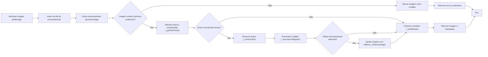
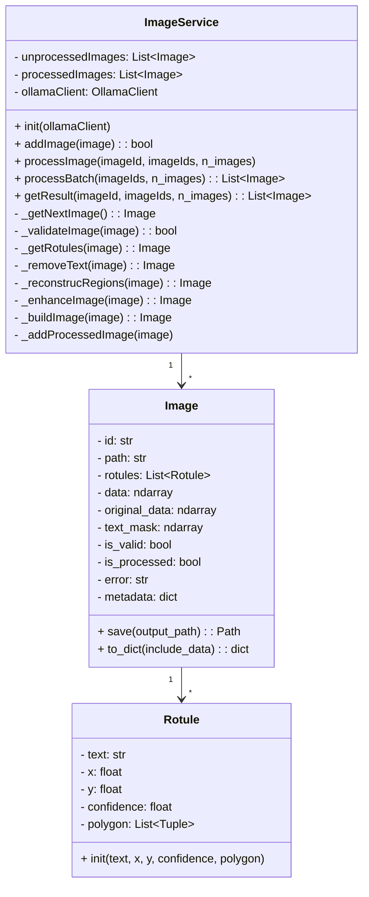

# Serviço de processamento de imagens

O presente serviço foi elaborado com o propósito de centralizar as funcionalidades de tratamento das imagens enviadas pelo usuário ou obtidas de um documento PDF.

O serviço deverá ser capaz de:
- Carregar imagens em uma lista de processamento;
- Verificar, antes de adicionar à lista, se a imagem enviada contem estruturas anatômicas;
- Identificar os textos, rótulos presentes na imagens;
- Registrar os textos identificados, com suas respectivas posições (X, Y) na imagem;
- Remover os elementos textuais;
- Reconstruir as àreas afetadas pela remoção textual;
- Disponibizar a imagem processada e os metadados extraídos;
- Utilizar, opcionalmente, o cliente Ollama para o ajuste das imagens reconstruídas;

O serviço constitui um componente de processamento do sistema e, portanto, não realiza acesso direto a bases de dados. A persistência dos resultados deverá ser responsabilidade de outro serviço ou camada da aplicação.

## Estrutura

O serviço poderá disponibilizar um conjunto reduzido de funções públicas, mantendo as etapas internas de processamento encapsuladas:

#### Públicas
- `addImage`: adiciona uma nova imagem na fila de processamento;
- `processImage`: executa o pipeline de processamento de uma imagem;
- `processBarch`: processa um conjunto de imagen presentes na fila (*n* valores, *lista* de ids ou todas por padrão);
- `getResult`: retorna o resultado de processamento das imagens (*n* valores, *lista* de ids ou todas por padrão).

#### Etapas internas de processamento
1. `_getNextImage`: obtém a próxima imagem da lista, removendo-a da mesma;
2. `_validateImage`: verifica se a imagem é valida e se contém uma estrutura anatômica;
3. `_getRotules`: identifica os textos presentes na imagem e suas respectivas coordenadas;
4. `_removeText`: remove os textos e rótulos identificados;
5. `_reconstrucRegions`: recontroí as regiões afetadas pela removação textual;
6. `_enhanceImage`: se houver um modelo de IA informado no construtor, realiza os ajustes adicionais na imagem usando um prompt;
7. `_buildImage`: organiza a imagem processada e os metadados extraídos para retornar à fila;
8. `_addProcessedImage`: adiciona numa fila de imagens processadas a imagem.

## Fluxograma


## Modelos

`Rotule`: Contém a informação de um rótulo, como o texto e coordenadas.

`Image`: Contém as informações gerais da imagem a ser usada, como seu caminho, flags de processamento, textos e coordenadas.



## Instalação e uso

As dependências ficam isoladas neste módulo:

```bash
pip install -r imageService/requirements.txt
```

O código requer Python 3.10 ou mais recente. A suíte rápida pode ser executada
na raiz do repositório com:

```bash
python -m unittest discover -s imageService/tests -v
```

O CLIP e o EasyOCR são carregados apenas quando necessários. Na primeira
execução, as bibliotecas podem baixar os pesos dos modelos. O resultado fica em
memória no atributo `data` do modelo e pode ser persistido explicitamente com
`Image.save(...)`; o arquivo original nunca é sobrescrito.

```python
from imageService import Image, ImageService

service = ImageService(verbose=1, ocr_gpu=False)
image = Image(id="figura-1", path="imagens/anatomia.png")

if service.addImage(image):
    result = service.processImage()
    result.save("resultados/figura-1.png")
    metadata = result.to_dict()
```

Por padrão, `processImage()` consome somente o próximo item da fila e
`processBatch()` consome todos. Ambos aceitam seleção por IDs/quantidade;
`getResult()` retorna todos os resultados quando nenhum filtro é informado.

Para testes ou ambientes sem o CLIP, pode-se fornecer
`anatomy_validator=lambda pixels: True` ou usar `validate_anatomy=False` (neste
último caso ocorre apenas a validação estrutural do arquivo). O OCR também pode
ser substituído por meio de `ocr_reader`.

O parâmetro opcional `image_enhancer` recebe uma função com a assinatura
`(ndarray, prompt) -> ndarray`. Quando são usados `ollamaClient` e
`ollama_model`, o modelo visual escolhe parâmetros conservadores em JSON e o
OpenCV aplica os filtros, pois a API de visão do Ollama não edita pixels
diretamente.

As coordenadas `x`/`y` de cada `Rotule` representam o centro do texto em
pixels. A serialização também fornece `normalizedPosition` no intervalo 0–1;
ela não representa o ponto anatômico indicado por uma eventual linha-guia.


